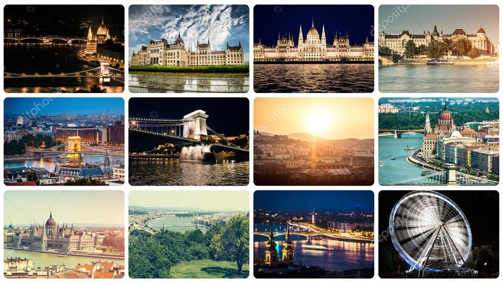

# Descomplica
# 🌍 Agência de Viagens

## ✈️ Visão Geral
A **Agência de Viagens** é uma aplicação web desenvolvida para oferecer aos usuários a possibilidade de explorar pacotes turísticos, consultar taxas de serviços e solicitar orçamentos de forma prática e intuitiva. Utilizando o Bootstrap, a aplicação é responsiva e se adapta a qualquer dispositivo.

## 📸 Capturas de Tela


## 🛠️ Tecnologias Utilizadas
- **HTML5**: Para estruturação do conteúdo.
- **CSS3**: Para estilização da aplicação.
- **Bootstrap 5**: Framework CSS para design responsivo.


## 📚 Funcionalidades
- **Navegação Simples**: Um menu de navegação claro para acessar pacotes, contatos e taxas.
- **Pacotes Turísticos**: Apresentação de imagens e descrições dos principais destinos.
- **Tabela de Taxas**: Informações sobre serviços disponíveis e seus respectivos valores.
- **Formulário de Contato**: Para solicitações de orçamento personalizadas.

## 🎨 Estilização e Design
### Cores
- **Fundo**: `bg-info` (azul claro)
- **Cabeçalho**: `bg-primary` (azul escuro)
- **Texto**: Branco em destaque

### Tipografia
- **Título Principal (h1)**: Tamanho 63px, centrado, cor branca.
- **Subtítulos (h2)**: Tamanho 53px, peso 500, cor branca, texto transformado para maiúsculas.

## 🚀 Como Executar o Projeto
1. **Clone o repositório**:
   ```bash
   git clone [https://github.com/seu-usuario/agencia-de-viagens.git](https://github.com/RenathaLoiza/Descomplica.git)
   
### Dicas para Customização
- **Links**: Adicione links diretos para as imagens ou para o seu repositório no GitHub.
- **Estilo**: Você pode personalizar ainda mais a formatação, como adicionar badges para tecnologias ou status do build.
- **Imagens**: Insira mais capturas de tela de diferentes seções da aplicação para mostrar o design e a funcionalidade.

Sinta-se à vontade para ajustar qualquer parte do conteúdo de acordo com suas preferências!


